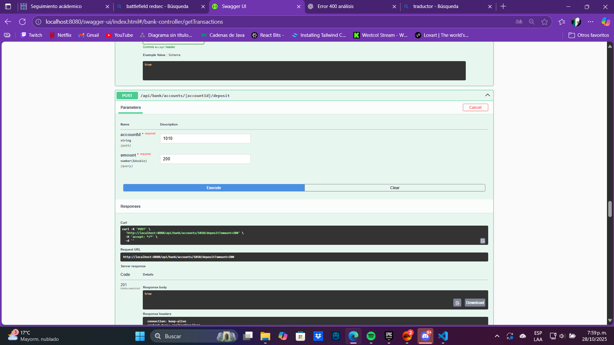
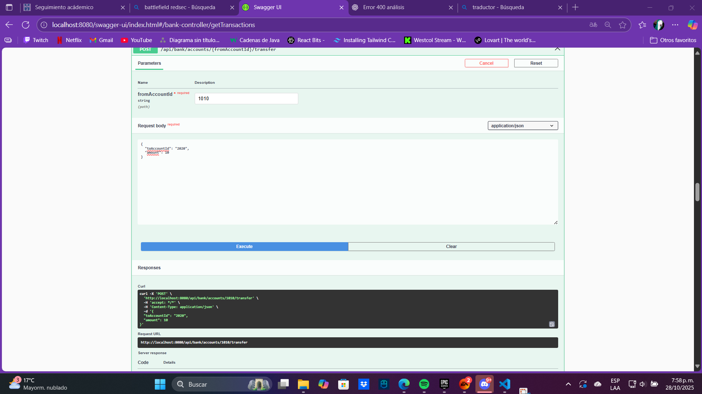
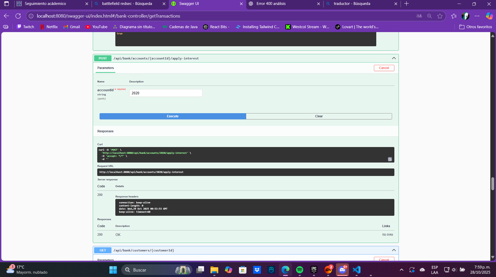

# 🏦 AppBank - Aplicación Bancaria con Spring Boot

## 📘 Descripción General
**AppBank** es una aplicación desarrollada con **Spring Boot** que simula el funcionamiento básico de un banco.  
Permite crear y administrar cuentas, realizar transacciones (depósitos, retiros), manejar saldos y aplicar estrategias de cálculo de intereses.  

El proyecto sigue una arquitectura típica de **Spring Boot**, con una separación clara de responsabilidades entre capas: **modelo**, **servicio**, **repositorio** y **utilidades**.

---

## 🚀 Punto de Entrada
### `AppbankApplication.java`
- Es la **clase principal** de la aplicación.
- Usa la anotación `@SpringBootApplication` para indicar a Spring que es el punto de inicio.
- Al ejecutarse, **inicializa todo el entorno de Spring Boot**.

---

## 🧩 Modelos 

### `Account.java` (Cuenta)
- Clase **abstracta base** para representar una cuenta bancaria.
- Define operaciones comunes:
  - Depósitos y retiros  
  - Seguimiento de transacciones  
  - Gestión del saldo  
- Sirve como base para otros tipos de cuentas (como la corriente).

### `CheckingAccount.java` (Cuenta Corriente)
- Implementa las funciones específicas de una **cuenta corriente**.
- Características:
  - Permite **manejar sobregiros** (saldo negativo).  
  - No calcula intereses.

### `Transaction.java` 
- Representa una **operación bancaria individual**.  
- Guarda información como:
  - Tipo de transacción (depósito, retiro, etc.)
  - Monto
  - ID de la cuenta
  - Fecha y hora (marca de tiempo)

---

## ⚙️ Servicios 

### `BankService`
- **Interfaz** que define las operaciones principales del banco.
- Se encarga de:
  - Gestionar clientes y cuentas  
  - Realizar operaciones (depósitos, retiros, etc.)

### `BankServiceImpl`
- **Implementación concreta** de `BankService`.
- Contiene la **lógica de negocio** (cómo se aplican las reglas y cálculos).

### `InterestStrategy`
- Define una **estrategia para calcular intereses**.
- Permite modificar la forma de calcular tasas sin cambiar el resto del sistema.
- Actualmente se usa una versión simple (interés básico).

---

## 💾 Repositorios (Acceso a Datos)

### `FileManager`
- Se encarga del manejo de **archivos JSON**.
- Permite:
  - Leer y escribir datos en archivos.  
  - Guardar cuentas y transacciones sin necesidad de una base de datos.

### `JsonRepository`
- **Interfaz genérica** para acceso a datos.
- Define operaciones **CRUD** (crear, leer, actualizar, eliminar).
- Puede reutilizarse para distintos tipos de entidades.

---

## 🧰 Utilidades

### `JsonUtil`
- Contiene **herramientas auxiliares** para trabajar con JSON.
- Permite:
  - Convertir objetos Java ↔ JSON  
  - Leer y guardar datos fácilmente en archivos  
  - Simplificar el manejo de persistencia

 ---

## 📡 Pruebas con Thunder Client

### ⚙️ FUNCIONAMIENTO DE THUNDER CLIENT EN EL PUERTO 8080

---

### 📥 PRUEBA SIRVE EL GET

---

### 🔍 PRUEBA SIRVE GET POR ID

---

### 📤 PRUEBA SIRVE EL POST

### 🤖 PRUEBA SWAGGER (COMPLETAS)

## 🧾 Clientes

## 💰 Cuentas y Transacciones

## 💵 Operaciones

## 📈 Intereses

